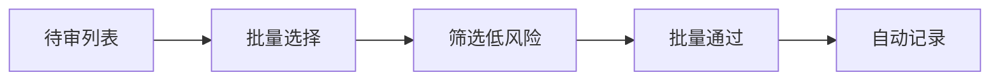

## 1. 产品概述

内容审核移动 App，为品牌和媒体审核人员提供随时随地处理待发布素材的能力，提升审核效率与内容质量。

- **目标用户**：品牌内容审核员、媒体编辑、内容运营人员
- **核心价值**：移动化审核、高效批量处理、精准风险管控

## 2. 核心功能

### 2.1 用户角色

| 角色 | 核心权限 |
|------|----------|
| 普通审核员 | 查看待审列表、审核内容、填写意见、查看规则、个人统计 |
| 高级审核员 | 转交专业审核、批量通过低风险内容、查看栏目排期 |

### 2.2 功能模块

1. **待审页面**：待审核列表、栏目筛选、优先级筛选、搜索
2. **详情页面**：图文视频预览、敏感段落标注、审核操作
3. **对比页面**：修改前后版本差异对比
4. **意见页面**：常用意见、收藏意见、意见填写
5. **日历页面**：栏目排期、发布时间设置
6. **规则页面**：审核规则、规则搜索
7. **个人页面**：处理量统计、批量操作、离线暂存

### 2.3 页面详情

| 页面名称 | 模块名称 | 功能描述 |
|----------|----------|----------|
| 待审页 | 顶部筛选栏 | 按栏目筛选、按优先级筛选、搜索历史稿件 |
| 待审页 | 内容列表 | 展示待审核素材卡片，含标题、栏目、优先级、超时提醒 |
| 待审页 | 批量操作 | 批量选择、批量通过低风险内容 |
| 详情页 | 内容预览 | 图文混排预览、视频播放 |
| 详情页 | 敏感标注 | 高亮显示敏感段落、支持点击查看规则 |
| 详情页 | 操作区 | 通过、驳回、退回修改、转交专业审核、设置发布时间 |
| 详情页 | 意见区 | 填写审核意见、快捷插入常用意见 |
| 对比页 | 版本选择 | 选择对比的两个版本 |
| 对比页 | 差异展示 | 左右分栏或上下对比，高亮差异内容 |
| 意见页 | 常用意见列表 | 展示系统常用意见、支持搜索 |
| 意见页 | 收藏管理 | 收藏/取消收藏、收藏列表展示 |
| 日历页 | 日历视图 | 月视图展示排期 |
| 日历页 | 排期详情 | 查看当日各栏目发布计划 |
| 规则页 | 规则分类 | 按分类展示审核规则 |
| 规则页 | 规则搜索 | 关键词搜索规则 |
| 个人页 | 数据统计 | 今日/本周/本月处理量、通过率统计 |
| 个人页 | 离线暂存 | 查看已暂存的审核意见 |
| 个人页 | 设置入口 | 消息通知、超时提醒设置 |

## 3. 核心流程

### 3.1 审核流程

审核员打开待审列表 → 筛选栏目和优先级 → 点击进入详情 → 预览内容并查看敏感标注 → 填写审核意见 → 选择通过/驳回/退回修改 → 确认提交

### 3.2 批量审核流程

审核员选择多条低风险内容 → 一键批量通过 → 系统自动记录审核结果

## 4. 用户界面设计

### 4.1 设计风格

- **设计理念**：专业高效、清晰克制、以内容为中心
- **主色调**：深蓝色系（#1E40AF）传递专业与信任感
- **辅助色**：绿色（#059669）通过、橙色（#D97706）待处理、红色（#DC2626）驳回
- **字体**：系统字体，强调可读性
- **卡片风格**：圆角 12px，轻投影，层次分明
- **图标风格**：线性图标，简洁现代

### 4.2 页面设计概览

| 页面名称 | 模块名称 | UI 元素 |
|----------|----------|---------|
| 待审页 | 顶部导航 | 标题、搜索图标、筛选按钮 |
| 待审页 | 筛选条 | 横向滚动标签、优先级胶囊 |
| 待审页 | 列表卡片 | 标题、栏目标签、优先级标签、时间、超时提醒角标 |
| 详情页 | 内容区 | 标题、作者、时间、正文图文混排 |
| 详情页 | 敏感标注 | 黄色背景高亮、悬浮提示规则引用 |
| 详情页 | 底部操作栏 | 通过（主色）、驳回（红色）、退回（灰色） |
| 对比页 | 版本切换 | 顶部 Tab 切换对比模式 |
| 对比页 | 差异内容 | 绿色新增、红色删除标记 |
| 意见页 | 分类 Tab | 全部、我的收藏 |
| 意见页 | 意见卡片 | 意见内容、使用次数、收藏图标 |
| 日历页 | 日历网格 | 日期格子、排期数量角标 |
| 规则页 | 折叠列表 | 分类展开/收起 |
| 个人页 | 统计卡片 | 数据数值、趋势小图 |
| 个人页 | 功能入口 | 列表式菜单、箭头指示 |

### 4.3 响应式设计

- **移动端优先**：以 375px 宽度为基准设计
- **底部导航**：固定底部五个 Tab 导航
- **触控优化**：按钮最小高度 44px，间距充足
- **手势支持**：左滑操作、下拉刷新

### 4.4 动效设计

- **页面切换**：左右滑入滑出
- **列表加载**：骨架屏 + 渐入
- **按钮点击**：缩放反馈
- **敏感标注**：悬停/点击时的高亮动画
- **数据更新**：数字滚动动效
