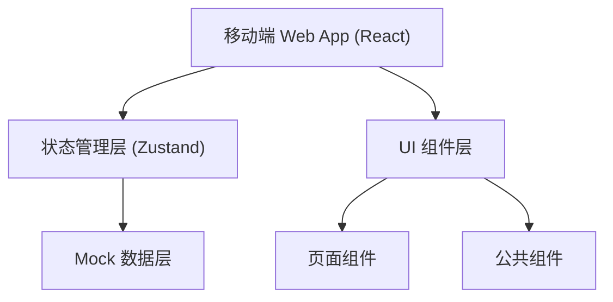

## 1. 架构设计



## 2. 技术描述

- **前端框架**：React@18 + TypeScript
- **构建工具**：Vite@5
- **样式方案**：TailwindCSS@3
- **路由管理**：React Router v6
- **状态管理**：Zustand
- **图标库**：Lucide React
- **数据方案**：Mock 数据（localStorage 模拟持久化）

## 3. 路由定义

| 路由 | 页面 | 说明 |
|------|------|------|
| / | 待审页 | 默认首页，待审核列表 |
| /detail/:id | 详情页 | 内容详情与审核操作 |
| /compare/:id | 对比页 | 修改前后版本对比 |
| /opinions | 意见页 | 常用意见与收藏 |
| /calendar | 日历页 | 栏目排期 |
| /rules | 规则页 | 审核规则 |
| /profile | 个人页 | 统计与设置 |

## 4. 数据模型

### 4.1 内容稿

```typescript
interface Article {
  id: string;
  title: string;
  author: string;
  category: string;
  priority: 'high' | 'medium' | 'low';
  status: 'pending' | 'approved' | 'rejected' | 'returned';
  submitTime: string;
  deadline: string;
  isOverdue: boolean;
  content: ArticleContent;
  versions: Version[];
  sensitiveSections: SensitiveSection[];
  riskLevel: 'low' | 'medium' | 'high';
}

interface ArticleContent {
  type: 'article' | 'image' | 'video';
  text: string;
  images?: string[];
  videoUrl?: string;
}

interface Version {
  id: string;
  version: number;
  content: string;
  submitTime: string;
  editor: string;
}

interface SensitiveSection {
  id: string;
  startIndex: number;
  endIndex: number;
  type: string;
  ruleId: string;
  description: string;
}
```

### 4.2 审核意见

```typescript
interface Opinion {
  id: string;
  content: string;
  category: string;
  usageCount: number;
  isFavorite: boolean;
}
```

### 4.3 审核规则

```typescript
interface Rule {
  id: string;
  title: string;
  category: string;
  description: string;
  examples: string[];
}
```

### 4.4 日历排期

```typescript
interface Schedule {
  date: string;
  items: ScheduleItem[];
}

interface ScheduleItem {
  id: string;
  title: string;
  category: string;
  publishTime: string;
  status: 'scheduled' | 'published';
}
```

### 4.5 用户统计

```typescript
interface UserStats {
  todayCount: number;
  weekCount: number;
  monthCount: number;
  approvalRate: number;
  categoryStats: CategoryStat[];
}

interface CategoryStat {
  category: string;
  count: number;
}
```

## 5. 核心功能实现方案

### 5.1 待审列表筛选

- 按栏目筛选：多标签切换
- 按优先级筛选：胶囊按钮
- 搜索功能：标题模糊匹配
- 批量操作：复选框 + 批量通过按钮

### 5.2 敏感段落标注

- 文本内容分段渲染
- 根据敏感词位置添加高亮背景
- 点击标注弹出规则详情气泡

### 5.3 版本对比

- 使用 diff-match-patch 算法计算差异
- 左右分栏展示两个版本
- 新增内容绿色背景，删除内容红色删除线

### 5.4 离线暂存

- 使用 localStorage 存储未提交的审核意见
- 进入详情页时检测是否有暂存内容
- 支持恢复和清除暂存

### 5.5 超时提醒

- 计算当前时间与截止时间差值
- 超时内容显示红色角标和倒计时
- 列表顶部超时提醒横幅
